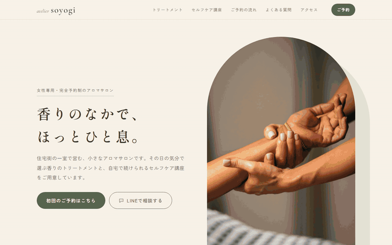

# atelier soyogi 初回予約LP

atelier soyogi（架空のアロマサロン）のLPを、Claude Codeで設計〜実装しました。

副業ポートフォリオ用の作品例です。atelier soyogi は、女性専用・完全予約制のアロマサロン＋セルフケア講座という設定の**架空のサロン**で、実在の店舗・サービスではありません（ページのフッターにも同じ旨を表示しています）。

**公開ページ：https://tmy-adc329.github.io/aroma-soyogi-lp/**

## デモ

`index.html` をブラウザで直接開くだけで表示できます（ビルド不要。CSS/JSはHTMLにインライン）。

## これは何

住宅街の一室で営む小さなアロマサロン「atelier soyogi（アトリエ そよぎ）」の、初回予約用LPです。メニューは「アロマトリートメント」と「はじめてのアロマセルフケア講座（全3回・単発の体験講座あり）」の2つで、サロンLPと講座LPの両方の型を1枚で見せています。

想定ターゲットは30〜40代の働く女性・子育て中の女性です。サロン自体が初めての人も多い前提で、「どんな人がやっているのか」「当日どう過ごすのか」「料金がはっきりしているか」の3つの不安を減らす構成にしています。「今すぐ」「限定」などの煽りは使わず、やわらかく落ち着いたトーンで書いています。

写真を使わずに組んだGijiLog（ポートフォリオ①）と対になる、「写真ありき・女性向けナチュラル系」の作例です。

## ページ構成

| # | セクション | 役割 |
|---|---|---|
| 1 | ヒーロー | 大きな写真とキャッチコピー、予約ボタン・LINE相談ボタン |
| 2 | こんな方へ | ターゲットの気持ち4点を言語化して共感を作る |
| 3 | soyogiについて | コンセプトと、女性専用・完全予約制・少人数の3つの特徴 |
| 4 | メニュー① アロマトリートメント | 内容と料金（60分／90分） |
| 5 | メニュー② アロマセルフケア講座 | 全3回の内容、体験講座と全3回の料金カード、開催日程の枠 |
| 6 | セラピスト紹介 | 顔写真は使わず、道具の写真と文章で構成 |
| 7 | ご予約から当日までの流れ | 4ステップで当日の過ごし方まで見せる |
| 8 | お客様の声 | レイアウトのみ（下記「設計の考え方」参照） |
| 9 | よくある質問 | 開閉式のQ&A |
| 10 | アクセス・営業情報 | 住所・営業時間などは未確定の扱い |
| 11 | 最終CTA | 予約フォームとLINE相談 |

スマートフォン幅から組み始め、タブレット・デスクトップ幅へ段階的にレイアウトを広げています。

## 予約フォーム

予約フォームは**ダミー送信**です。「予約を申し込む」を押しても実際には送信されず、入力内容をブラウザのコンソールに出力し、画面に「デモのため送信は行われません」と表示するだけです。LINEで相談するボタンのリンク先も仮（`#`）です。

- 項目：お名前／メールアドレス／希望メニュー（アロマトリートメント・体験講座の2択）／第1希望日／ご質問（任意）
- 各メニューの「予約する」ボタンから来た場合は、希望メニューが選択済みになります
- 実際の送信サービス（SSGformなど）に後から差し替えやすいよう、素直な `<form>` にしています

## 設計の考え方

**写真を主役にする。** GijiLogとは逆に、写真がある前提の案件として作りました。フリー素材（Unsplash / Pexels）をクライアント支給の写真とみなし、大きく使っています。

- 精油ボトルなどにブランド名・ロゴが読める写真は、トリミングで外すか、外せないものは使っていません
- 人物の写真は手元だけのものを使い、「セラピスト本人」「お客様」として見せていません
- お客様の声は、架空の名前・感想を書くと作り話のレビューを本物のように見せることになるため、カードのレイアウトだけを作り、本文は画面上でも見本と分かる表示にしています

**アロマサロンの広告ルールに合わせて書く。** 架空の作例でも、実案件と同じくあはき法・薬機法などの広告ルールに沿って書いています。

- 「マッサージ」は使わず（あん摩マッサージ指圧師の有資格者以外は使えないため）、「トリートメント」と書いています
- 「疲労回復」「改善」「効く」などの効果効能・治療を思わせる表現は避け、「ほっとひと息」「自分をいたわる時間」のように、体験や時間の過ごし方として伝えています

**あとから直す人が迷わないようにする。** 受託を想定し、納品後にクライアント側で手を入れやすい形にしています。

- ブランドカラー（セージグリーン）は `:root` の `--brand` 1行だけで変更できます。淡い色・濃い色はそこから `color-mix()` で自動生成しています
- 住所・営業時間・セラピストの経歴・講座日程など、実際の情報が必要な箇所は仮の文章で埋めず、`<!-- CLIENT: ... -->` コメントを付けたうえで、画面上でも「（〜が入ります）」と未確定であることが分かる表示にしています

**参考デザインは「咀嚼して使う」。** 配色や構成の参考にはCanvaのテンプレートを複数使いましたが、特定の1枚を模倣せず、セージ×ベージュの配色とアーチ形の写真、写真を大きく使ったセクションの区切り、講座の内容から料金・申込へつなぐ見せ方といった要素を組み合わせて独自の構成にしています。テンプレートの画像や素材そのものは使っておらず、リポジトリにも含めていません（Canvaの規約上、テンプレートの再配布にあたるため）。

## 写真の出典

写真はすべて Unsplash / Pexels のフリー素材（商用利用可）です。Web表示用に縮小し、一部はブランド名などが写り込んだ部分をトリミングしています。

| ファイル | 撮影者 / サイト | 元の写真 |
|---|---|---|
| `images/hero_treatment-arm.jpg` | Stephen Olmo / Unsplash | https://unsplash.com/photos/hands-massaging-a-persons-forearm-with-gentle-pressure-YBfzGCJjLuI |
| `images/foryou_tea.jpg` | krzhck / Unsplash | https://unsplash.com/photos/a-cup-of-tea-sitting-on-top-of-a-table-Rf7rODR0hIo |
| `images/about_towels.jpg` | Engin Akyurt / Pexels | https://www.pexels.com/photo/white-towel-on-brown-woven-basket-4177714/ |
| `images/treatment_oil.jpg` | Karola G / Pexels | https://www.pexels.com/photo/a-masseuse-pouring-oil-on-her-hand-6629607/ |
| `images/course_mortar.jpg` | Yan Krukau / Pexels | https://www.pexels.com/photo/a-person-mixing-herbs-by-hand-in-the-mortar-5480253/ |
| `images/course_herbs-jars.jpg` | Timothé Durand / Unsplash | https://unsplash.com/photos/a-person-putting-herbs-in-small-glass-jars-_PNuHlFWm_4 |
| `images/course_workshop.jpg` | Annie Spratt / Unsplash | https://unsplash.com/photos/people-mixing-items-on-bowl-XiWtCLWK5K8 |
| `images/therapist_oil-vial.jpg` | Kelly Sikkema / Unsplash | https://unsplash.com/photos/opened-amber-glass-vial-bottle-UaO58q6ioxI |
| `images/cta_dried-flowers.jpg` | Thea Hdc / Unsplash | https://unsplash.com/photos/white-flowers-on-white-textile-VLyyGVNrR9k |

## 技術スタック

- HTML / CSS / JavaScript（フレームワーク・ビルドツールなし、HTMLにインライン）
- Google Fonts（Shippori Mincho / Zen Kaku Gothic New / Cormorant Garamond）

## 開発について

設計と実装には Claude Code（AIコーディング支援）を使っています。
仕様（ターゲット、CTA、メニューと料金、トーン、広告表現のルール、写真の扱い、スコープ外の線引き）は
[brief.md](./brief.md) にまとめています。

## 今回やらないこと（スコープ外）

- 実際のフォーム送信・予約システム連携（ダミー送信）
- LINE公式アカウントの実連携（リンクは仮）
- 地図の埋め込み
- ロゴのデザイン（テキストロゴで代替）
- 多言語対応、ブログ・お知らせ機能

## ライセンス

個人のポートフォリオ／学習プロジェクトです。現時点でライセンスファイルは設定していません（無断転載・改変・商用利用は不可）。再利用可能な形にしたい場合は別途ライセンスを設定します。写真の権利は各撮影者に帰属し、Unsplash License / Pexels License に従います。
